# Sherpa Coder - VS Code Extension
Visit [www.sherpacoder.dev](https://www.sherpacoder.dev)

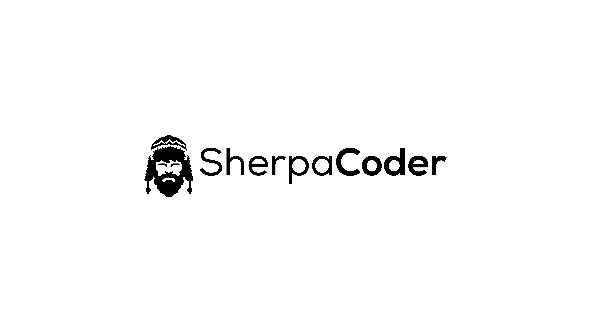

🚀 Welcome to the Sherpa Coder extension for Visual Studio Code! ✨ This extension is designed to enhance your coding experience by integrating OpenAI assistants directly into your VS Code environment. 🤖

## Getting Started

### 1. Create Your Account
To begin using Sherpa Coder, you'll need to create an account. Simply provide an alias for your account name and enter your OpenAI API Key. All information is stored locally on your machine - there are no external servers involved, only direct communication with the OpenAI API. This will enable you to access all the powerful features of the extension.

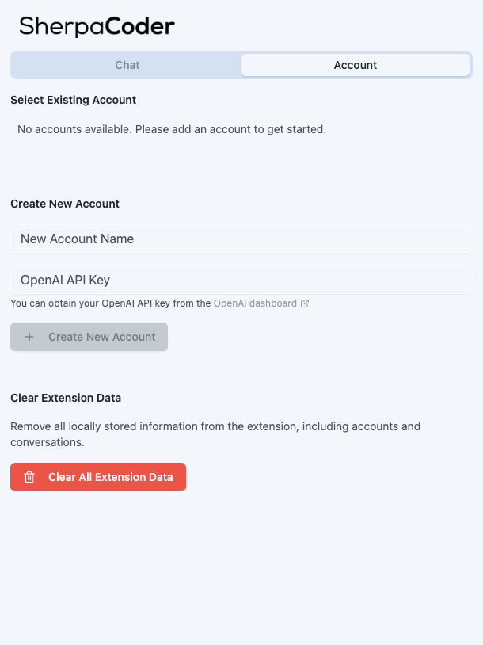

### 2. Select Your Account
Once your account is set up, choose it from the accounts list to start using the extension.

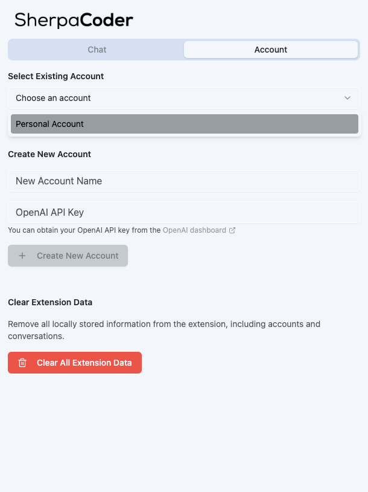

### 3. Wait for your account to load
We will stablish connection to OpenAI using the provided API Key.

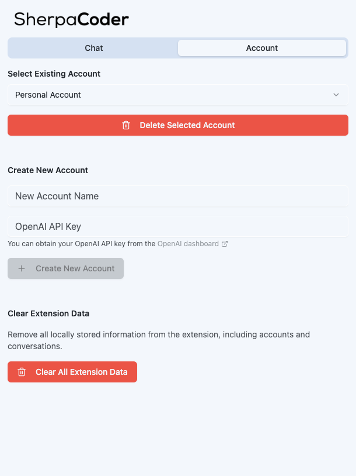

### 4. Access the Chat Interface
Navigate to the chat tab to initiate a new conversation with the AI assistant.

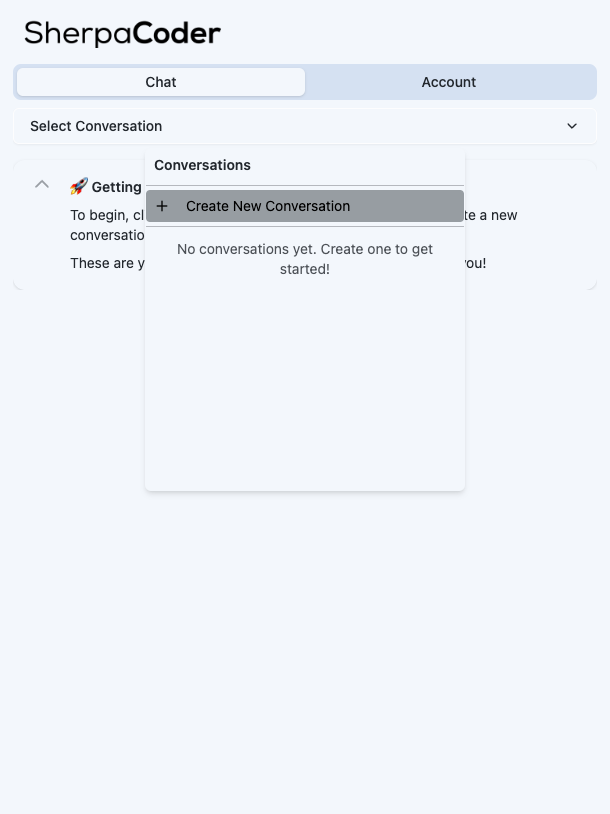

### 5. Give your conversation a name
Give your conversation a meaningful name to help you organize and track your interactions.

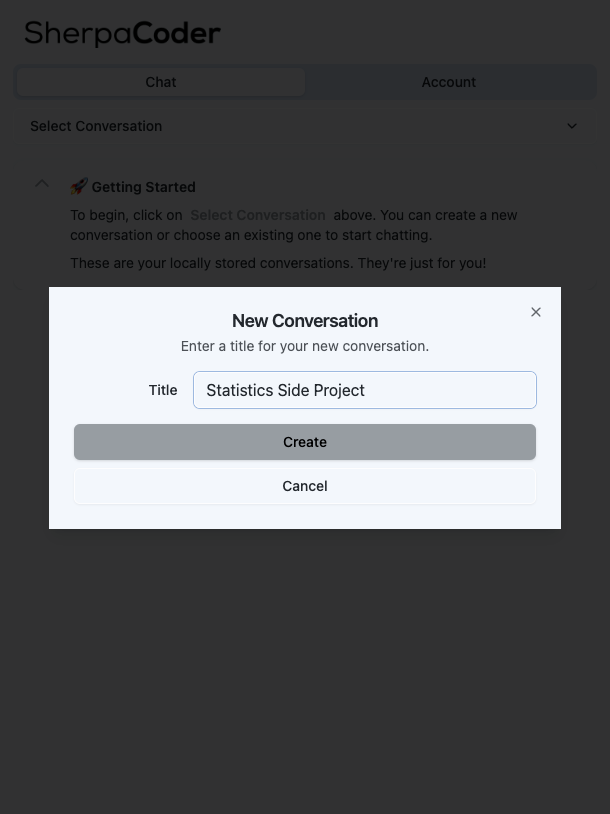

### 6. Explore the chat dialog
You will see the chat dialog of your new conversation

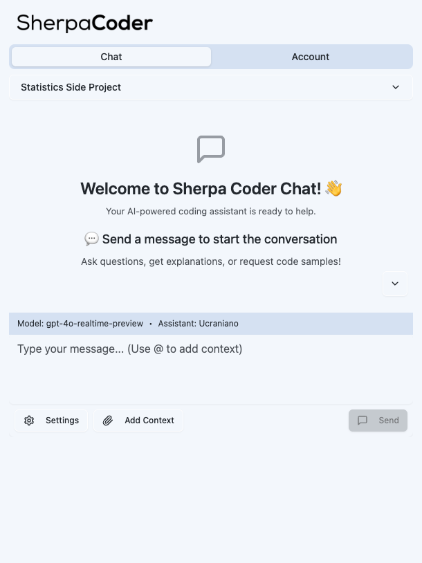

### 7. Customize Your Experience
Click on settings to choose your preferred AI model and assistant for each message, tailoring the interaction to your specific needs.

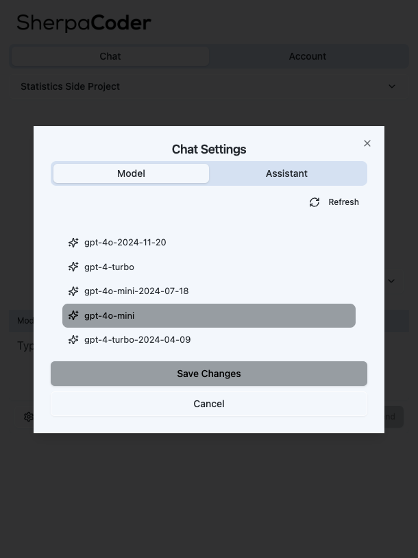

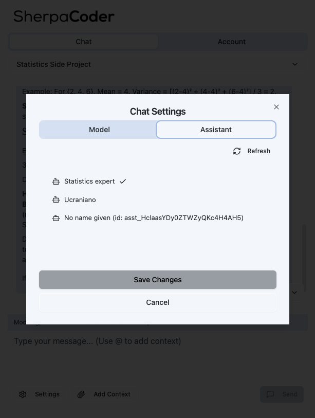

### 8. Write your first message

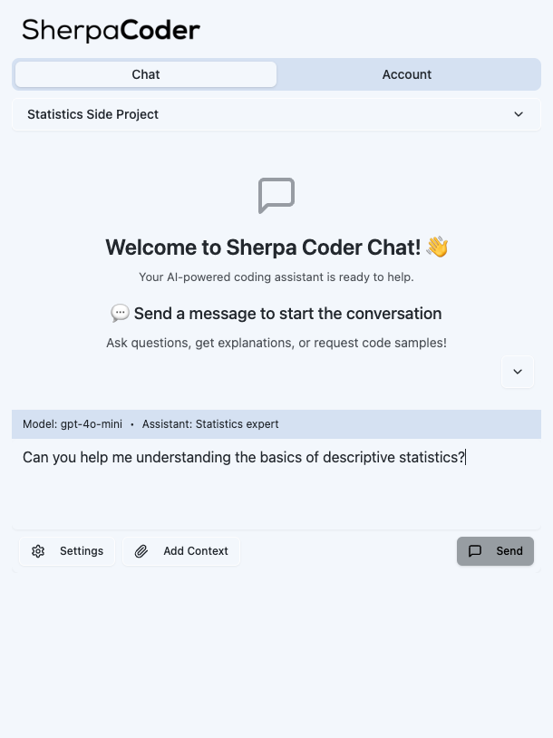

### 9. Your assistant answer will be streamed

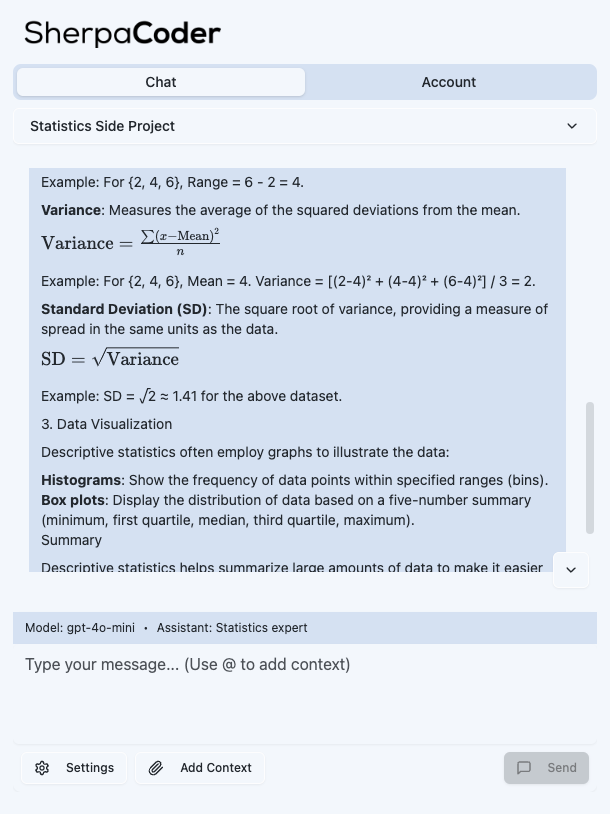

### 10. Enhance with File Attachments
Take advantage of the powerful file attachment feature:
- Attach files directly from your workspace
- Generate and attach a markdown file containing your entire workspace's source code
- Provide context-rich information to the AI assistant

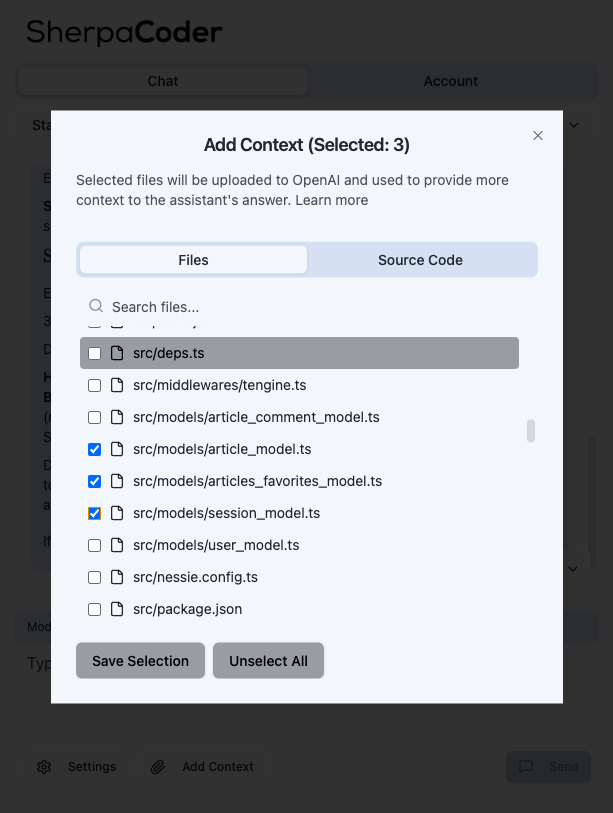

You can also attach the full source code of the current workspace. For this we will create a markdown file containing your source code. We will omit the files from gitignore and binary files that you might have in your workspace.

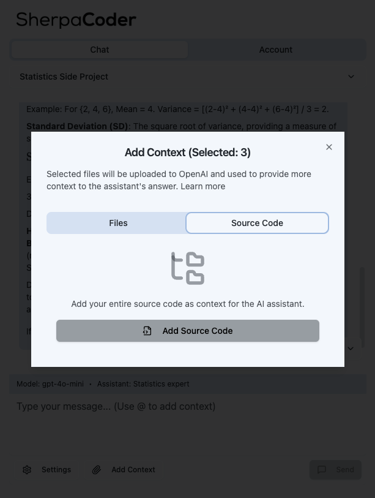

## Important Notes

### File Search Capability
To utilize the attachments feature effectively, ensure that your OpenAI assistants have the "search in files" feature activated in their assistant settings.

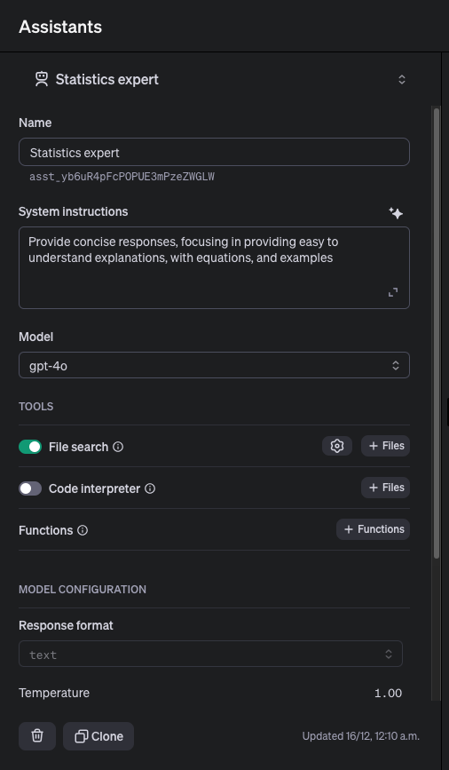

### Files Retention Policy
Files stored in threads are subject to OpenAI API's default retention policy. For more information, please refer to the [OpenAI documentation](https://platform.openai.com/docs/assistants/tools/file-search)

## Contributing
This is an open source project and contributions are welcome! If you'd like to contribute, feel free to submit a pull request or open an issue.

## Support the Project
If you find this extension helpful, you can support its development by buying me a coffee:

